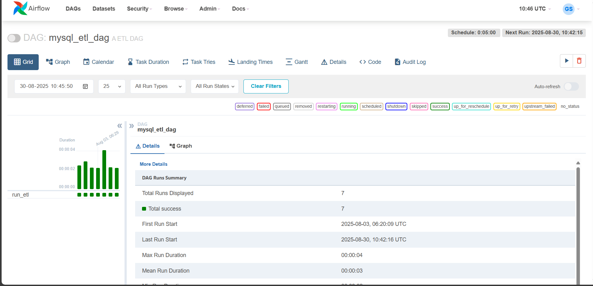
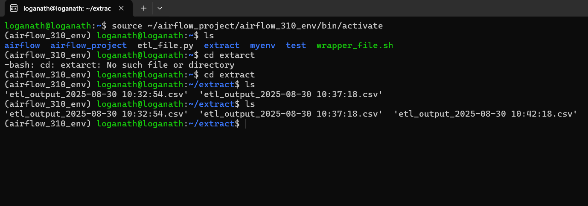
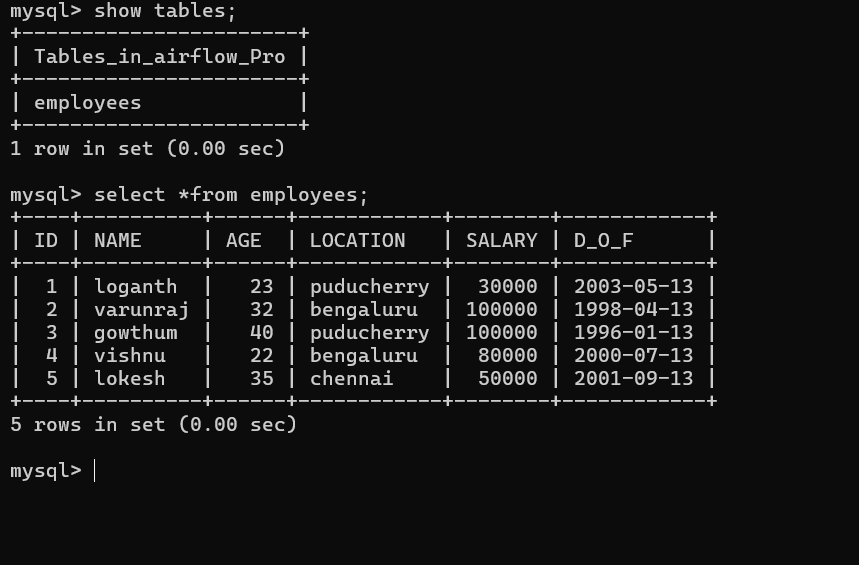

# ETL AUTOMATION USING USING AIRFLOW, MYSQL, LINUX AND PYTHON PROJECT

This project demonstrates an end-to-end ETL (Extract, Transform, Load) pipeline built using Apache Airfl ow. The pipeline extracts data from a MySQL database, transforms it using Python, and loads the results into a CSV fi le for further use.

---- 

## TECH STACK:
-Apache Airfl ow – Workfl ow orchestration & scheduling
-MySQL – Source database
-Python – Data extraction & transformation
-Bash – Wrapper script for orchestration

----

## FEATURES:
-Automated ETL pipeline scheduled every 5 minutes with Airfl ow DAGs
-Custom retry logic and fault tolerance
-Python scripts for data extraction & transformation
-Data stored in CSV format for easy access
-Logs and monitoring through Airfl ow UI

----

##HOW IT WORKS:
-Extract → Read data from a MySQL database (spotify_track table) using Python.
-Transform → Clean and prepare the data (e.g., select columns, format values).
-Load → Save the transformed data into CSV fi les for easy access.
-Orchestrate → Use Apache Airfl ow DAG to schedule and monitor the entire ETL pipeline.

----

##SCREENSHOTS:

